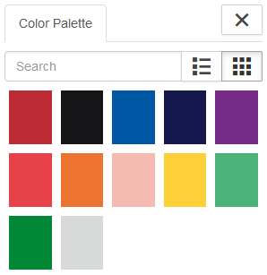

# PhD submission and defence

## Preparations (3 months before thesis submission)

The submission at the end of the 3-year PhD is more than submission of the PhD thesis alone. The following documents have to prepared and submitted as well, either beforehand or simultaneously with the PhD thesis. To ensure a smooth PhD submission, the documents apart from the PhD thesis can be submitted before the hand-in date to be approved already. All documents should be submitted to the [PhD school of DTU Biosustain](mailto:CFB-PhD@biosustain.dtu.dk).

### PhD submission checklist

The [PhD submission checklist form](https://www.inside.dtu.dk/-/media/dtu-inside/undervisning/undervisningsadministration/phd-uddannelse-administratorer/skemaer) has to be filled out and signed before submission together with the PhD thesis. All components of the checklist are listed below, but the checklist itself should not be forgotten.

### Approval of the assessment committee

The [assessment committee approval form](https://www.inside.dtu.dk/-/media/dtu-inside/undervisning/undervisningsadministration/phd-uddannelse-administratorer/skemaer/assessment-committee-members.pdf) has to be filled out and signed before sending it to the PhD school to be approved. For the assessment committee, 3 members are required: one from DTU and two external, preferably from outside Denmark and their level should be at least assistant professor or equivalent in industry. Anyone you have collaborated and/or published with is exempt from taking part in your assessment committee. The approval form should be send for approval around 3 months before the PhD submission to allow for sufficient time for the approval, since the PhD school committee only meets once a month. It is advisable to start contacting potential assessment committee members around 6 months before your hand-in date, because it can take some time to find them. Please note that a CV and publication list of each assessment committee member are required as an attachment to the approval form.

### Co-author statements

The main chapters of the PhD thesis are usually published or unpublished manuscripts and thus require co-author statments: one per chapter/manuscript. So, the [co-author statement form](https://www.inside.dtu.dk/-/media/dtu-inside/undervisning/undervisningsadministration/phd-uddannelse-administratorer/skemaer/co-author-statement.docx) has to be filled out and signed separately for each chapter/manuscript with the corresponding authors. An example of a filled-out co-author statement form can be found [here](https://www.inside.dtu.dk/-/media/dtu-inside/undervisning/undervisningsadministration/phd-uddannelse-administratorer/skemaer/co-author-statement-example.pdf). Once all co-author statement forms are completed, they can be compiled into one file and submitted with the other documents for the final PhD submission.

### Popular science summary

The [popular science summary](https://www.inside.dtu.dk/-/media/dtu-inside/undervisning/undervisningsadministration/phd-uddannelse-administratorer/skemaer/popular-summary.docx) will be send out with the announcement of the PhD defence, but needs to be submitted within the PhD submission.

### Supervisor report

The supervisor report goes through PhDigital and is initialised by the PhD student one month before the hand-in date. The supervisor report has to be submitted and **approved** before the hand-in date, so this is an important part of the PhD submission.

## PhD thesis submission

There are a few guidelines to consider for the PhD thesis itself, however most of the thesis is up to the PhD student and their preferences. Generally, the PhD thesis includes 3 main chapters which can be either published articles or unpublished manuscripts, a general introduction chapter, and a conclusions and recommendations chapter. The final chapter, i.e. conclusions and recommendations, should have the specific structure of each conclusion or recommendation as one sentence in bold with a following paragraph elaborating the conclusion or recommendation. Usually, there are 2 conclusions and 1 recommendation per chapter and the conclusions and recommendations should be in the ordered after (potential) impact. It is crucial to check the guidelines of scientific journals if published articles or unpublished manuscripts are allowed to be imbedded in the PhD thesis in their original format. PhD thesis titles need to be comprehensible and enticing to a potential reader, while at the same time not being so general and vague as to obscure what the PhD thesis is about. Furthermore, titles should be concise and informative. Abbreviations and formulae should be avoided where possible. It is recommended to include a few keywords in the title to aid web-searches. The final PhD thesis should be submitted to the [PhD school of DTU Biosustain](mailto:CFB-PhD@biosustain.dtu.dk) and to the supervisor team. The PhD school will forward the PhD thesis to the central PhD administration, who will send it to the assesssment committee members.

### Templates

There is no official template for the PhD thesis document, but you can adapt the [general DTU report template](https://www.inside.dtu.dk/en/medarbejder/om-dtu-campus-og-bygninger/kommunikation-og-design/skabeloner/rapporter?rfb=eyJwIjpmYWxzZSwidWlkIjoiMjYzMTA5ODgtYWViOS00YzAyLWI1ZWQtNDg0NDIwZTZjZGJhIiwic2NwIjoiaW50ZXJuYWwiLCJrYmlkIjozNTAsInNpZCI6InZ4STZqcTJ5WkJPeW02d0JkcGlWMnciLCJhaWQiOjI1MjgzNywic2VjaWQiOjkyMTM3MjQ3LCJzdCI6IndlYl9zY3JhcGUifQ) to fit the thesis. Official DTU logos, colours and other templates can be found in the [DTU design guide](https://designguide.dtu.dk/). Please note that the document should be set as a two-page rather than a one-page document, since the final thesis will be printed double-sided as a book format.

### Preface of the PhD thesis

For inspiration on the structure of the PhD thesis, it can be useful to refer to previous PhD theses from the DTU Biosustain department. The preface section typically uses Roman numerals as the page numbering. The first page should contain the title of the thesis, the month and year of submission, author name, the copyright and the department publishing the thesis. Following this should be a page with the written approval which should be dated and signed by the PhD student. Afterwards follows the abstract, the Danish abstract, list of publications, acknowledgements, table of contents, and list of figures and tables.

### Cover design

For the cover, there is a template available from the [DTU design guide PhD thesis section](https://designguide.dtu.dk/print), but most PhD students produce their own cover design. The cover should as a minimum have the DTU logo in the top left corner, the DTU department in the top right corner, the title of the PhD thesis and the name of the PhD student. Please refer to the [DTU design guide logo section](https://designguide.dtu.dk/logo) for the appropriate use of the DTU logo, department name, etc. The cover is allowed to be any colour, but it is important to know that the spine of the printed PhD thesis can only be selected from 12 different DTU colours. So, if you want the colour of the cover to match the colour of the spine, please refer to the colour codes in the section below in advance.

## PhD defence (within 3 months of PhD thesis submission)

After reading and assessing the PhD thesis, the assessment committee will send a preliminary approval document to the central PhD administration, which will forward it to the PhD student and the supervisors. The PhD student can officially defend their thesis after a positive preliminary recommendation, submitted to PhD school at DTU Biosustain at least two weeks prior to the scheduled defence by the central PhD administration. They will get the official approval from DTU to announce the defence. The principal supervisor arranges a date and time for the defence with the members of the assessment committee and the PhD student within 3 months of the submission of the PhD thesis and must ensure that assessment committee get at least 2 months to read the thesis. The defence takes place at DTU Biosustain, where the supervisor must book the conference room R213. In case an in-person defence is not possible for a valid reason, we are open to participate online. In case of pending patents, the PhD student might be forced to postpone the defence following directions of the Businness office at DTU Biosustain and the PhD student can defend after the patent is filed. More information about the defence proceedings can be found [here](https://www.inside.dtu.dk/en/undervisning/regler/phd-uddannelse-studerende/phd-afslutning/bedoemmelse-forsvar-grad/forsvar).

### Practical matters prior to the defence 
Announcement by the PhD school of DTU Biosustain of the public defence (online or at DTU) via DTU calendar and in engineering weekly Ingeniøren, and together with a summary is sent to the press presse@dtu.dk. This is all taken care of and not a responsibility of the PhD student. The PhD student should find a chairman for the defence specifically, which is typically a group leader (PI) from DTU Biosustain. The chairman of the public defence should receive the [checklist for the defence proceedings](https://www.inside.dtu.dk/-/media/dtu-inside/undervisning/undervisningsadministration/phd-uddannelse-administratorer/skemaer/chair-checklist-defence.docx), the announcement send by the PhD school of DTU Biosustain, and a PDF version of the PhD thesis.

### Practicalities regarding the opponents 
The supervisor hosts the assessment committee and coordinates the program for their stay at DTU Biosustain on the day. This is mainly the responsibility of the supervisor, but good to know about for the PhD student.

DTU Biosustain's support unit will assist organising the event: 
* Reception: Hotel & flight booking read about DTU's travel guidelines.
* Event Coordinator Jeanette: ordering lunch and flowers for the PhD student.
* HR & Finance keepsakes that we act within DTU rules.
 
### Expense claims and Honorary 
The assessment committee should claim the Honorary and travel reimbursement via e-forms. Please ask the [DTU Biosustain reception unit](mailto:reception@biosustain.dtu.dk) in case Fusion support is needed. This is mainly the responsibility of the supervisor, but good to know about for the PhD student.

Claims covered by DTU Biosustain: 
* Maximum of 3 nights at a hotel for the examiners.
* Economy flight ticket to Denmark.
* Taxi vouchers through DTU Biosustain reception.
* Representation dinner of the assessment committee members at a restaurant on the evening before the defence. 
* PhD honorary for assessment members external to DTU (16 hours at a rate of 500 DKK an hour).

### Printing of the PhD thesis

The printing of the PhD thesis is the responsibility of the PhD student, however the costs are covered by the PhD school of DTU Biosustain for a budget up to 7,000 DKK. Usually, the PhD students print around 40 copies of their PhD thesis including copies for the supervisors, assessment committee members, chair of the defence and PhD school at DTU Biosustain. Ordering the printed PhD theses is done through Fusion:

* Log into Fusion and select "Procurement" in the main menu. 
* Choose "Purchase Requisitions (Search)"
* Enter "step print power" in the search field
* Click on "Step Print Power - External Store" in the search results

For the Step Print Power store, you can following the [PhD thesis printing guide](https://www.inside.dtu.dk/-/media/dtu-inside/medarbejder/om-dtu-campus-og-bygninger/kommunikation-og-design/trykkeri/guide-til-cover-generering.pdf). Make sure to actually count the number of pages with colour in the PhD thesis, since this impact the total price significantly.

Available colours and corresponding CYMK codes for the spine and cover of the printed PhD thesis:

* DTU red (0, 91, 72, 23)
* Black (20, 20, 10, 100)
* Blue (100, 64, 0, 0)
* Dark blue (100, 90, 0, 60)
* Purple (67, 96, 0, 0)
* Red (0, 86, 65, 0)
* Orange (0, 35, 26, 0)
* Pink (0, 35, 26, 0)
* Yellow (0, 19, 84, 0)
* Bright green (69, 0, 66, 0)
* Green (89, 5, 100, 17)
* Grey (0, 0, 0, 20)

For the shipping on the printed PhD theses, the official address for DTU Biosustain is: Søltofts Plads, bygning 220, 2800 Lyngby. For the billing, the [official EAN numbers list](https://www.dtu.dk/Om-DTU/kontakt-og-besoeg/for-leverandoerer/samhandel-med-dtu/ean-numre) states the EAN number for DTU Biosustain: 5798000430297.

## Award of the PhD dimploma

After the public defence, the assessment committee will send the final recommendation document to the central PhD administration, who will forward it to the supervisors. A positive final recommendation will result in the awarding of the PhD diploma to the PhD student. DTU issues a diploma to persons who have acquired the PhD degree. The diploma states the title of the thesis and the PhD school/ department where the studies took place. The diploma is issued in a combined Danish/English version. An amendment to the diploma is prepared stating the ECTS activities completed during the PhD studies. The diploma is issued when all elements of the PhD study have been completed. After the defence, it may take up to 4 months, until the PhD graduate receives their diploma. The length of this period depends on the date of the final recommendation being submitted to the central PhD administration, as well as the date of the first succeeding meeting of the relevant PhD school committee.

